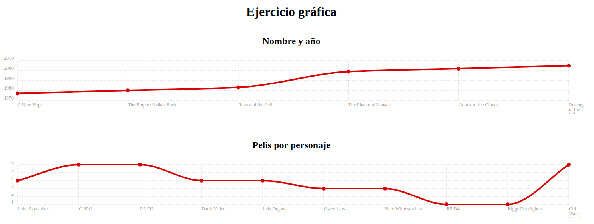

# Proyecto de Gráficas con Chartist.js

Este proyecto visualiza información de la API de Star Wars utilizando la biblioteca de gráficas Chartist.js. Consiste en dos gráficos: uno que muestra los títulos de las películas y sus años de lanzamiento, y otro que muestra la cantidad de películas en las que aparece cada personaje.

## Tabla de Contenidos

- [Instalación](#instalación)
- [Uso](#uso)
- [Estructura del Proyecto](#estructura-del-proyecto)
- [Detalles de Implementación](#detalles-de-implementación)
- [Licencia](#licencia)

## Instalación

Para ejecutar este proyecto localmente, sigue estos pasos:

1. Clona este repositorio:
    
    git clone https://github.com/AdrianTerciado/Graficas.git
    
2. Navega al directorio del proyecto:
    
    cd Graficas
    
3. Abre el archivo `index.html` en tu navegador preferido.

## Uso

Una vez abierto el archivo `index.html` en tu navegador, verás dos gráficas:

1. **Nombre y Año**: Muestra los títulos de las películas de Star Wars y su año de lanzamiento.
2. **Pelis por Personaje**: Muestra los nombres de los personajes y la cantidad de películas en las que aparecen.

## Estructura del Proyecto

La estructura del proyecto es la siguiente:

- `index.html`: Contiene la estructura HTML y las referencias a los estilos y scripts necesarios.
- `style.css`: Define los estilos para el diseño de la página.
- `script.js`: Contiene el código JavaScript para obtener los datos de la API y generar las gráficas.

## Detalles de Implementación

### HTML

El archivo `index.html` configura la estructura básica de la página y las secciones donde se mostrarán las gráficas.

### CSS

El archivo style.css define la apariencia de la página y ajusta el diseño de las gráficas.

### JavaScript

El archivo script.js contiene el código para obtener los datos de la API de Star Wars y generar las gráficas utilizando Chartist.js

## Licencia

Este proyecto está bajo la Licencia MIT. Para más detalles, consulta el archivo LICENSE.